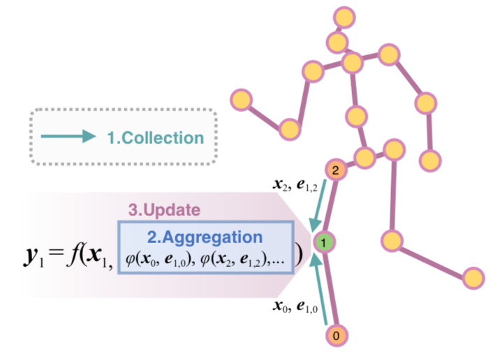
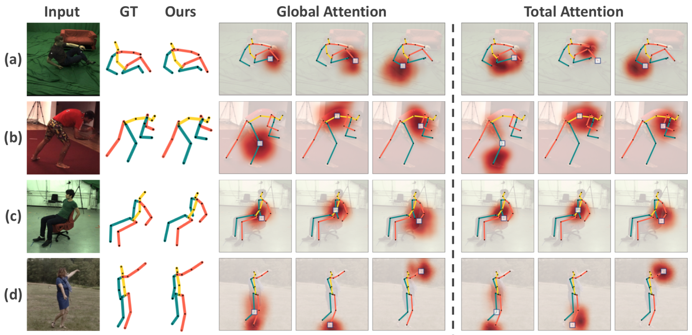
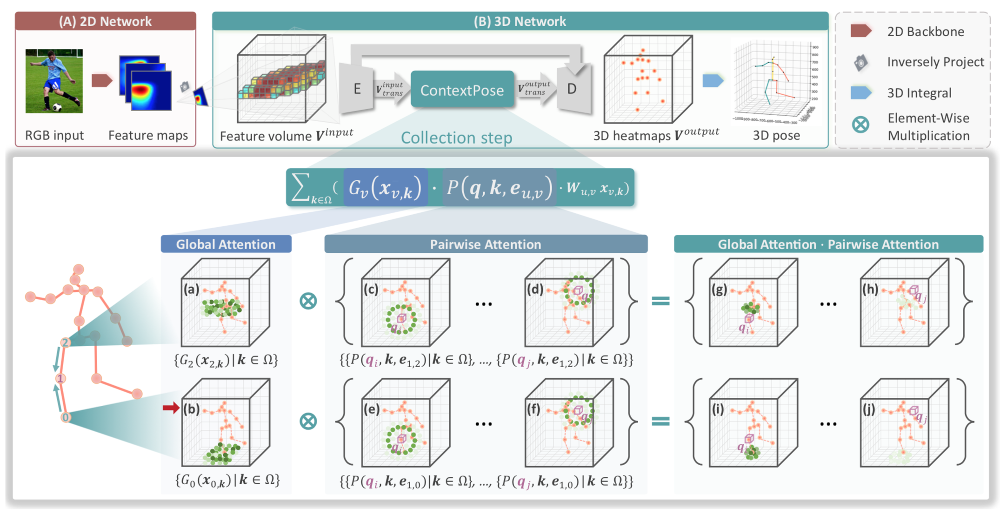
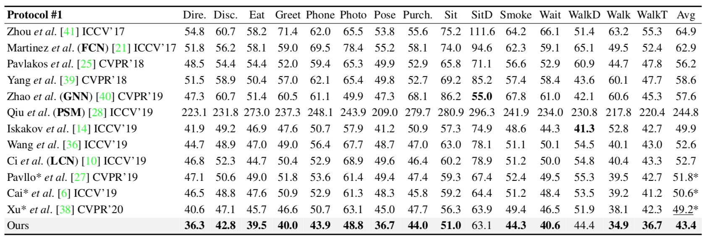
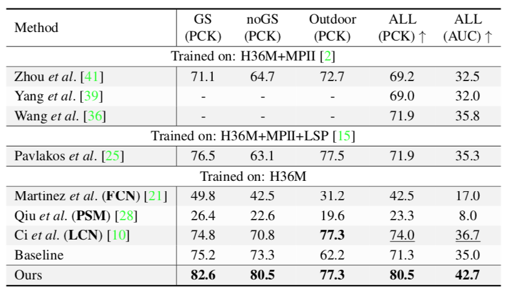

# Context Modeling in 3D Human Pose Estimation: A Unified Perspective (CVPR 2021)
<p float="left">
  
   
</p>


# Introduction
This repository is the offical [Pytorch](https://pytorch.org/) implementation of ContextPose, [Context Modeling in 3D Human Pose Estimation: A Unified Perspective (CVPR 2021)](https://arxiv.org/pdf/2103.15507.pdf). Below is the example pipeline of using ContextPose for 3D pose estimation.


# Quick start
## Environment
This project is developed using >= python 3.5 on Ubuntu 16.04. NVIDIA GPUs are needed.

## Installation
1. Clone this repo, and we'll call the directory that you cloned as ${ContextPose_ROOT}.
2. Install dependences.
    1. Install pytorch >= v1.4.0 following [official instruction](https://pytorch.org/).
    2. Install other packages. This project doesn't have any special or difficult-to-install dependencies. All installation can be down with:
      ```bash
      pip install -r requirements.txt
      ```
3. Download data following the next section. In summary, your directory tree should be like this
  ```
  ${ContextPose_ROOT}
  ├── data
  ├── experiments
  ├── mvn
  ├── logs 
  ├── README.md
  ├── process_h36m.sh
  ├── requirements.txt
  ├── train.py
  `── train.sh
  ```

## Data
*Note:* We provide the training and evaluation code on [Human3.6M](http://vision.imar.ro/human3.6m/description.php) dataset. We do NOT provide the source data. We do NOT own the data or have permission to redistribute the data. Please download according to the official instructions. 

#### Human3.6M
1. Install CDF C Library by following (https://stackoverflow.com/questions/37232008/how-read-common-data-format-cdf-in-python/58167429#58167429), which is **neccessary for processing Human3.6M data**.
2. Download and preprocess the dataset by following the instructions in [mvn/datasets/human36m_preprocessing/README.md](https://github.com/ShirleyMaxx/ContextPose-PyTorch-release/blob/master/mvn/datasets/human36m_preprocessing/README.md).
3. To train ContextPose model, you need rough estimations of the pelvis' 3D positions both for train and val splits. In the paper we use the [precalculated 3D skeletons](https://github.com/karfly/learnable-triangulation-pytorch#model-zoo) estimated by the Algebraic model proposed in [learnable-triangulation](https://github.com/karfly/learnable-triangulation-pytorch) (which is an opensource repo and we adopt their Volumetric model to be our baseline.) All **pretrained weights** and **precalculated 3D skeletons** can be downloaded at once [from here](https://drive.google.com/drive/folders/1yjnD47hdcFNvbQj87pXDgqGt52K7rz_z) and placed to `./data/pretrained`. Here, we fine-tuned the pretrained weight on the Human3.6M dataset for another 20 epochs, please download the weight [from here](https://1drv.ms/u/s!AtkZATuiDzAaiz0L8qkAMeB5DHQ8?e=HcS5E5) and place to `./data/pretrained/human36m`.
4. We provide the limb length mean and standard on the Human3.6M training set, please download [from here](https://1drv.ms/u/s!AtkZATuiDzAai0BTMZzHRR4z6Po8?e=Z1WEKj) and place to `./data/human36m/extra`.
5. Finally, your `data` directory should be like this (for more detailed directory tree, please refer to [README.md](https://github.com/ShirleyMaxx/ContextPose-PyTorch-release/blob/master/mvn/datasets/human36m_preprocessing/README.md))
  ```
  ${ContextPose_ROOT}
  |-- data
      |-- human36m
      |   |-- extra
      |   |   | -- una-dinosauria-data
      |   |   | -- ...
      |   |   | -- mean_and_std_limb_length.h5
      |   `-- ...
      `-- pretrained
          |-- human36m
              |-- human36m_alg_10-04-2019
              |-- human36m_vol_softmax_10-08-2019
              `-- backbone_weights.pth

  ```

## Train
Every experiment is defined by `.config` files. Configs with experiments from the paper can be found in the `./experiments` directory. You can use the `train.sh` script or specifically:

#### Single-GPU
To train a Volumetric model with softmax aggregation using **1 GPU**, run:
```bash
python train.py \
  --config experiments/human36m/train/human36m_vol_softmax_single.yaml \
  --logdir ./logs
```

The training will start with the config file specified by `--config`, and logs (including tensorboard files) will be stored in `--logdir`.

#### Multi-GPU
Multi-GPU training is implemented with PyTorch's [DistributedDataParallel](https://pytorch.org/docs/stable/nn.html#distributeddataparallel). It can be used both for single-machine and multi-machine (cluster) training. To run the processes use the PyTorch [launch utility](https://github.com/pytorch/pytorch/blob/master/torch/distributed/launch.py).

To train our model using **4 GPUs on single machine**, run:
```bash
python -m torch.distributed.launch --nproc_per_node=4 --master_port=2345 --sync_bn\
  train.py  \
  --config experiments/human36m/train/human36m_vol_softmax_single.yaml \
  --logdir ./logs
```

## Evaluation
After training, you can evaluate the model. Inside the same config file, add path to the learned weights (they are dumped to `logs` dir during training):
```yaml
model:
    init_weights: true
    checkpoint: {PATH_TO_WEIGHTS}
```

#### Single-GPU
Run:
```bash
python train.py \
  --eval --eval_dataset val \
  --config experiments/human36m/eval/human36m_vol_softmax_single.yaml \
  --logdir ./logs
```

#### Multi-GPU
Using **4 GPUs on single machine**, Run:
```bash
python -m torch.distributed.launch --nproc_per_node=4 --master_port=2345 \
  train.py  --eval --eval_dataset val \
  --config experiments/human36m/eval/human36m_vol_softmax_single.yaml \
  --logdir ./logs
```
Argument `--eval_dataset` can be `val` or `train`. Results can be seen in `logs` directory or in the tensorboard.

## Results & Model Zoo
- We evaluate ContextPose on two available large benchmarks: [Human3.6M](http://vision.imar.ro/human3.6m/description.php) and [MPI-INF-3DHP](http://gvv.mpi-inf.mpg.de/3dhp-dataset/).
- To get the results reported in our paper, you can download the weights and place to `./logs`.

| Dataset to be evaluated   | Weights             | Results             |
|---------------------------|:-------------------:|:-------------------:|
| Human3.6M                 | [link](https://1drv.ms/u/s!AtkZATuiDzAai0LO9PMORmSYVPJQ?e=79AX0W) | 43.4mm (MPJPE)|
| MPI-INF-3DHP              | [link](https://1drv.ms/u/s!AtkZATuiDzAai0GdIFjS60i8lqm-?e=o2Fulf) | 81.5 (PCK), 43.6 (AUC)     |

- For H36M, the main metric is MPJPE (Mean Per Joint Position Error) which is L2 distance averaged over all joints. To get the result, run as stated [above](https://github.com/ShirleyMaxx/ContextPose-PyTorch-release#evaluation).
- For 3DHP, Percentage of Correctly estimated Keypoints (PCK) as well as Area Under the Curve (AUC) are reported. Note that we directly apply our model trained on H36M dataset to 3DHP dataset without re-training to evaluate the generalization performance. To prevent from over-fitting to the H36M-style appearance, we only change the training strategy that we fix the backbone to train 20 epoch before we train the whole network end-to-end. If you want to eval on MPI-INF-3DHP, you can save the results and use the [official](http://gvv.mpi-inf.mpg.de/3dhp-dataset/) evaluation code in Matlab.

### Human3.6M
<p float="left">
  
</p>

### MPI-INF-3DHP
<p float="left">
  
</p>


# Citation
If you use our code or models in your research, please cite with:
```
@article{ma2021context,
  title={Context Modeling in 3D Human Pose Estimation: A Unified Perspective},
  author={Ma, Xiaoxuan and Su, Jiajun and Wang, Chunyu and Ci, Hai and Wang, Yizhou},
  journal={arXiv preprint arXiv:2103.15507},
  year={2021}
} 
```

# Acknowledgement
This repo is built on https://github.com/karfly/learnable-triangulation-pytorch. Part of the data are provided by https://github.com/una-dinosauria/3d-pose-baseline.
